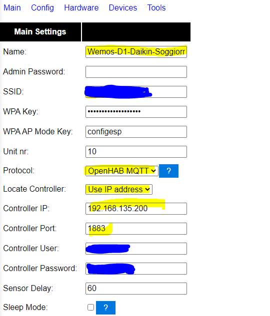
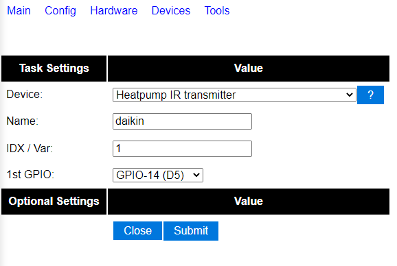
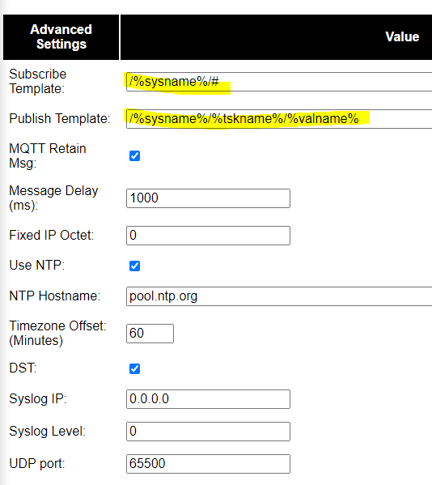
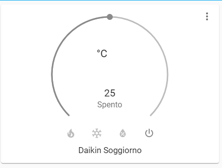
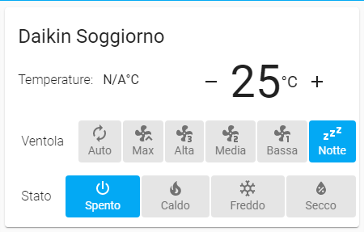

Obiettivo:

Interfacciare un vecchio condizionatore daikin per avere i principali
comandi in home assistant.

Materiale:

1 wemos mini

1 diodo ir emettitore

ovviamente tutto il necessario per costruirsi la propria board.

Attività da eseguire:

Flashare il wemos con fw espeasy allegato (si può fare sia con esptool
che con arduino che espeasyflash.

Al primo avvio dopo flash collegarsi alla rete wifi (ESP_0 nel mio caso)
generata dal wemos e andare a inserire il nome e psw della rete wifi a
cui deve collegarsi.

Fatto questo, lo stesso risulterà collegato al wifi scelto e sarà
raggiungibile all'indirizzo ip rilasciatogli dal router.

Possiamo procedere con la configurazione del modulo

|image0|

name: nome che identifica il dispositivo nella rete (lo stesso sarà
usato in mqtt)

ssid: sarà la rete wifi a cui collegato

wpa key: psw rete wifi a cui collegato

wpa ap mode key: psw che bisogna usare per collegarsi la prima volta al
sistema dopo il flash

unit nr: numero identificativo su rete espeasy (nel caso se ne abbiano
diversi)

protocol: selezionare openhab mqtt che è compatibile con HA

locate controller: uso modo ip

controller ip: inserire ip del controller mqtt

controller port: porta usata per mqtt

controller user: inserire un utente valito per mqtt

controller password: inserire la psw per utente definito al punto sopra

Configurare ora nel menù dei devices il nuovo dispositivo

|image1|

device: selezionare heatpump ir trasmitter

name: daikin (nel mio caso) segue elenco dispositivi testati e
compatibili

idx/var: 1

GPIO: GPIO-14(D5) nel mio caso

Andare a collegare un diodo ir emettitore tra gnd e il gpio configurato

Elenco device compatibili

-  daikin

-  daikin_arc417

-  panasonic_ckp

-  panasonic_dke

-  panasonic_jke

-  panasonic_nke

-  panasonic_lke

-  carrier_nqv

-  carrier_mca

-  midea

-  fujitsu_awyz

-  mitsubishi_fd

-  mitsubishi_fe

-  mitsubishi_msy

-  mitsubishi_fa

-  mitsubishi_heavy_zj

-  mitsubishi_heavy_zm

-  samsung_aqv

-  samsung_fjm

-  sharp

-  hyundai

-  hisense_aud

-  gree (generico)

-  greeyan

-  fuego

-  toshiba

Tools advanced setting

|image2|

Verificare che i template mqtt siano così definiti ed eventualmente
configurare un ntp server per avere gli orari nel log corretti.

Salvare ed eseguire un reboot del device.

In home assistant sono andato a definire una entità di tipo climate come
segue:

climate:

 - platform: mqtt

 name: 'Daikin Soggiorno'

 initial: 25

 min_temp: 18

 max_temp: 32

#current_temperature_topic: /status/Wemos-D1-Daikin-Soggiorno/HEATPUMPIR

 modes:

 - "off"

 - "heat"

 - "cool"

 - "dry"

 fan_modes:

 - "auto"

 - "maximum"

 - "high"

 - "medium"

 - "low"

 - "silent"

 power_command_topic: /Wemos-D1-Daikin-Soggiorno/HEATPUMPIR/POWER

 payload_on: 1

 payload_off: 0

 mode_command_topic: /Wemos-D1-Daikin-Soggiorno/HEATPUMPIR/MODE

 temperature_command_topic: /Wemos-D1-Daikin-Soggiorno/HEATPUMPIR/TEMP

 fan_mode_command_topic: /Wemos-D1-Daikin-Soggiorno/HEATPUMPIR/FAN

 qos: 1

Nel mio caso manca la parte di movimento orizzontale e verticale in
quanto non sono mai riuscito a farla funzionare, ma essendo per me un
aspetto non fondamentale non ho perso troppo tempo su questo argomento.

Dopo aver riavviato ha, e inserito in una nuova scheda l'entità creata
questo è il risultato

|image3|

Dato che personalmente la ritenevo troppo ingombrante e con i comandi
della ventilazione di difficile accesso se usata da tablet, ho usato una
custom card e il risultato è divenuto questo

control:

 fan:

 \_name: Ventola

 auto:

 name: Auto

 high:

 icon: 'mdi:fan-speed-3'

 name: Alta

 low:

 icon: 'mdi:fan-speed-1'

 name: Bassa

 maximum:

 icon: 'mdi:fan-chevron-up'

 name: Max

 medium:

 icon: 'mdi:fan-speed-2'

 name: Media

 silent:

 icon: 'mdi:sleep'

 name: Notte

 hvac:

 \_name: Stato

decimals: 0

entity: climate.daikin_soggiorno

name: Daikin Soggiorno

step_layout: row

step_size: 1

type: 'custom:simple-thermostat'

|image4|

lo spunto per questo progetto è stato preso da un articolo spagnolo che
potete trovare a questo indirizzo:

https://domoticaencasa.es/home-assistant-controla-aire-acondicionado-con-un-sonoff-basic/

